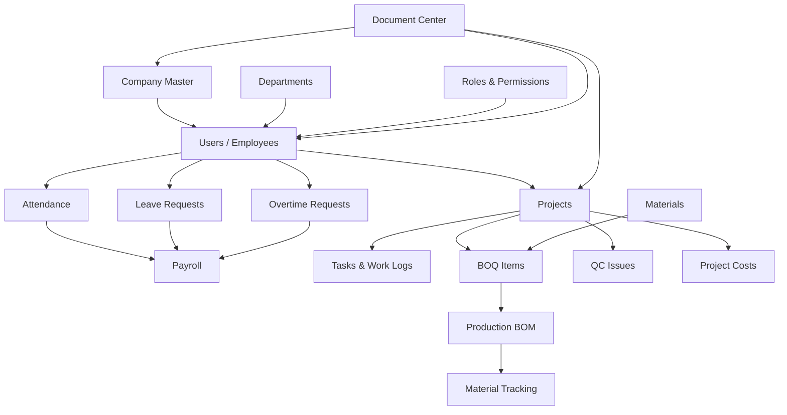

# HOMEPRO DEPENDENCY & FINANCIAL DATA MAP

## 1. DATA DEPENDENCY MAP
Cấu trúc hệ thống tuân thủ chặt chẽ luồng dữ liệu (Source of Truth), nghiêm cấm vòng lặp (Circular Dependency) và việc sao chép dữ liệu không cần thiết.

## 2. NGUYÊN TẮC SOURCE OF TRUTH
- **Employee Data:** `users` table là nguồn duy nhất. Không tạo bảng `payroll_employee` hay `hr_employee`.
- **Attendance Data:** `attendance` table chứa giờ công thực tế. `monthly_payroll` đọc dữ liệu từ đây, không duplicate.
- **Leave Data:** `leave_requests` là duy nhất. Khi đơn được duyệt, Payroll tự động cập nhật qua query, không copy dữ liệu sang bảng khác.

## 3. LUỒNG DỮ LIỆU TÀI CHÍNH (FINANCIAL DATA FLOW)
Mục tiêu là các module vận hành sẽ tự động hạch toán hoặc tạo chứng từ kế toán khi hoàn thành chu trình.

### 3.1. HR -> Payroll -> Accounting
`Attendance (Giờ công)` + `Leave (Phép)` + `Overtime (Tăng ca)` 
→ `Payroll (Tính lương)` 
→ **Sinh Expense (Chi phí lương)** 
→ `Accounting Ledger (Sổ cái kế toán)`

### 3.2. Project -> BOQ -> Production -> Cost
`BOQ (Dự toán)` 
→ `Material Usage (Tiêu hao vật tư)` 
→ `Project Costs (Chi phí dự án)` 
→ **Sinh Expense (Chi phí sản xuất/dự án)** 
→ `Profitability Report (Báo cáo lãi lỗ)`

### 3.3. Procurement -> Payable -> Cash/Bank (Tương lai)
`Purchase Order` 
→ `Goods Receipt` 
→ **Sinh Account Payable (Công nợ phải trả)** 
→ `Bank Payment (Thanh toán)` 
→ `Accounting Ledger`
