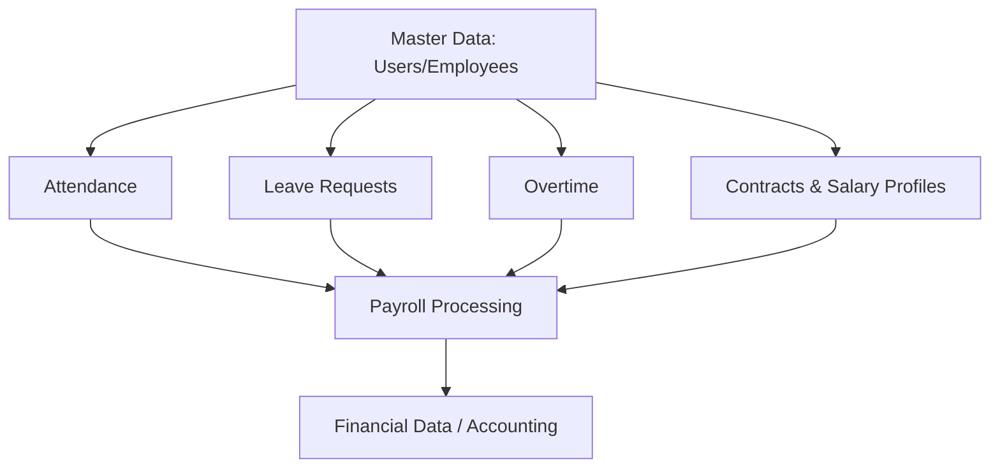
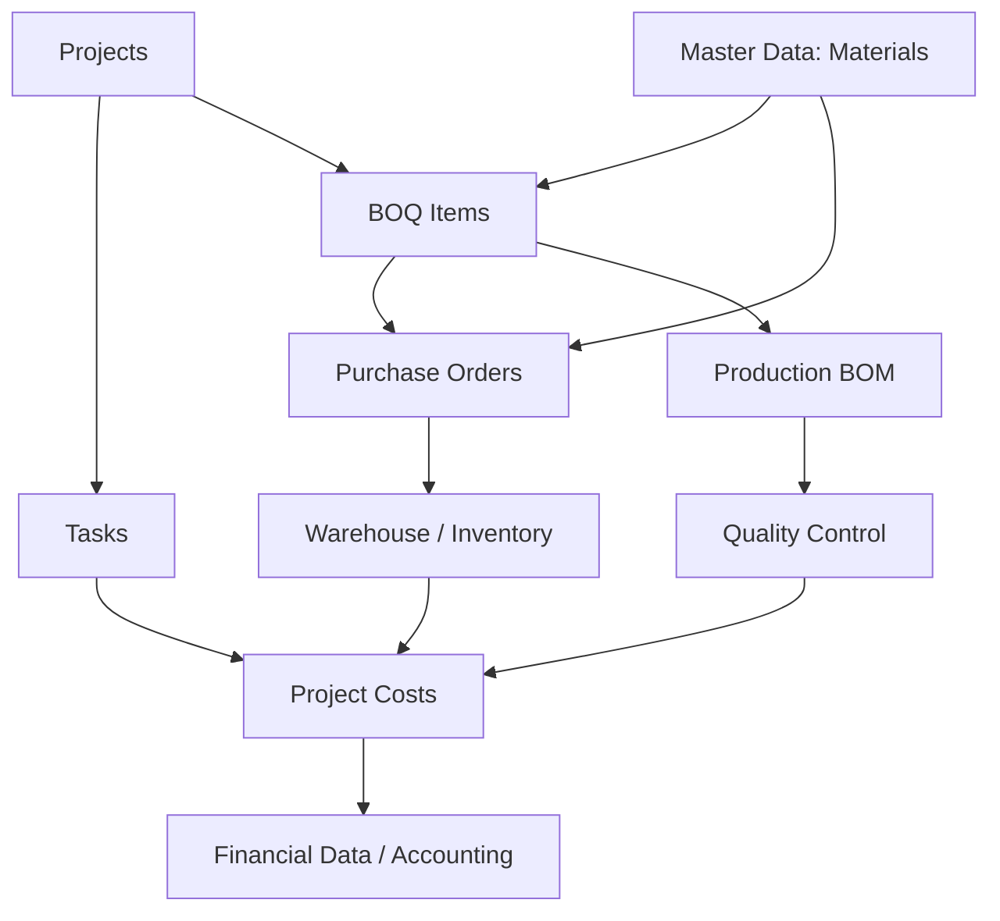

# Module Dependency Graph

This document illustrates the architectural and data dependencies between modules in the HomePro Manager ERP system.

## HR & Payroll Subsystem

## Production & Cost Subsystem

## Global Dependencies

- **Master Data (Users, Departments, Roles, Permissions)**: Upstream to ALL modules for RBAC and ownership.
- **Accounting / Finance**: The ultimate downstream module. It depends entirely on upstream data contracts (Payroll outputs, Purchasing costs, Material consumption) and MUST NOT duplicate business logic for calculating those costs.

## Financial Impact Points (Integration Contracts)
1. **HR → Accounting**: `monthly_payroll` (gross earnings, deductions, net salary, employer tax/BHXH).
2. **Project → Accounting**: `costs` (material consumption, external labor, logistics).
3. **Inventory → Accounting**: Valuation of stock, goods received notes.
