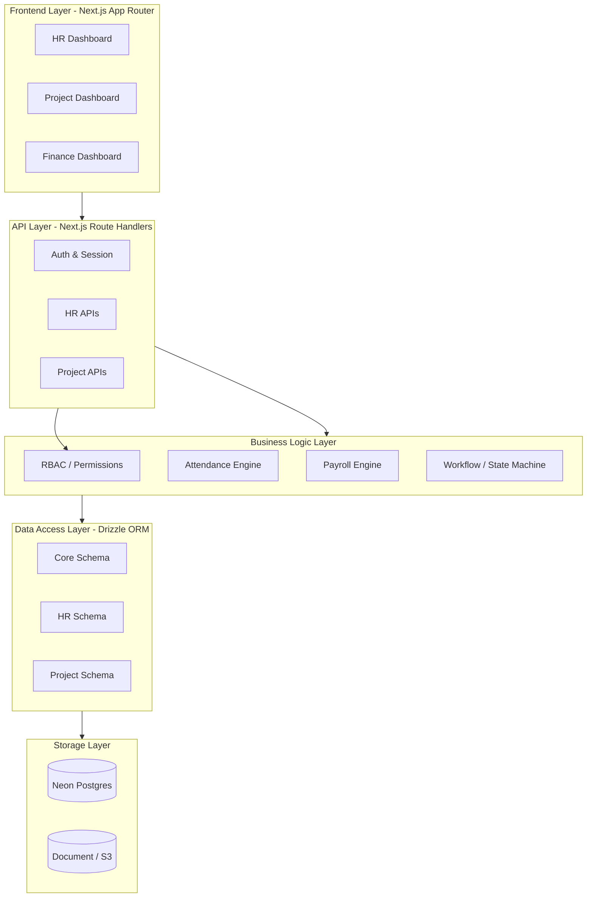

# HOMEPRO SYSTEM ARCHITECTURE

## 1. TỔNG QUAN HỆ THỐNG
HomePro là một hệ thống ERP/Quản trị Doanh nghiệp tùy chỉnh, kết hợp các khía cạnh của Nhân sự (HR), Quản lý Dự án (Project/Production) và Tài chính (Finance). Kiến trúc hệ thống được định hướng theo kiến trúc module lỏng (Loosely Coupled Modules) kết hợp với nguyên tắc Nguồn Sự Thật Duy Nhất (Single Source of Truth).

Mô hình này lấy cảm hứng từ Frappe/ERPNext và Odoo nhưng được thu gọn và tối ưu hóa cho công nghệ hiện đại (Next.js, Drizzle ORM, Neon PostgreSQL).

## 2. NGUYÊN TẮC THIẾT KẾ CỐT LÕI (CORE PRINCIPLES)

### 2.1. Nguồn dữ liệu duy nhất (Single Source of Truth)
- Mỗi domain nghiệp vụ chỉ có một và chỉ một nơi lưu trữ dữ liệu gốc.
- Các module khác muốn sử dụng dữ liệu phải **THAM CHIẾU (References/Foreign Keys)**, tuyệt đối **KHÔNG COPY/DUPLICATE**.
- Ví dụ: Không tồn tại khái niệm "Tài khoản nhân sự" và "Tài khoản hệ thống" riêng rẽ. `users` là bảng duy nhất chứa hồ sơ định danh của một con người.

### 2.2. Không phụ thuộc vòng (No Circular Dependency)
- Dòng chảy dữ liệu là một chiều (Unidirectional Data Flow).
- Module cấp cao có quyền gọi Module cấp thấp (Ví dụ: `Payroll` gọi `Attendance`).
- Module cấp thấp KHÔNG được gọi ngược Module cấp cao. Nếu cần tương tác, sử dụng mô hình Event-driven hoặc Pub/Sub (nếu hệ thống mở rộng) hoặc lưu ID một chiều linh hoạt.

### 2.3. Lõi Phân Quyền (RBAC + Context-based)
- Quyền truy cập không chỉ phụ thuộc vào `Role` tĩnh (VD: HR, Manager).
- Quyền truy cập phụ thuộc vào Ngữ Cảnh (Context) qua bảng `manager_departments`. Một Manager chỉ thấy dữ liệu của phòng ban mình phụ trách.

### 2.4. Tính Bất Biến (Immutability) và Kiểm Toán (Audit)
- Các tài liệu quan trọng (Phiếu lương, Đơn xin nghỉ đã duyệt) không được phép xóa (No hard-delete).
- Mọi thay đổi trạng thái hoặc chỉnh sửa dữ liệu gốc phải ghi Log qua bảng `hr_audit_logs` hoặc các bảng audit tương ứng.

## 3. CÁC TẦNG KIẾN TRÚC (ARCHITECTURAL LAYERS)

## 4. QUẢN TRỊ CÔNG TY & KẾ TOÁN (COMPANY & ACCOUNTING FOUNDATION)
Để mở rộng thành một ERP hoàn chỉnh, HomePro đang thiết lập nền tảng Pháp lý và Kế toán (Legal & Accounting):
- **Company Master:** Không gộp chung mọi thông tin vào một bảng. Phân tách rõ `CompanyLegalProfile`, `CompanyTaxProfile`, `CompanyBankAccount`.
- **Fiscal Periods:** Quản lý kỳ kế toán, kỳ khóa sổ. Bất kỳ chứng từ nào (Phiếu lương, Chi phí dự án) phát sinh trong kỳ khóa sổ đều không được sửa đổi.

## 5. QUẢN LÝ TÀI LIỆU (DOCUMENT CENTER)
Hệ thống lưu trữ file không nằm rải rác từng module mà được quản lý tập trung qua **Document Center**:
- Metadata tài liệu: Loại (Hợp đồng, Quyết định, Bệnh án), Người upload, Ngày hết hạn.
- Tính liên kết đa hình: Một tài liệu có thể liên kết với một `User`, một `Project`, hoặc một `Company`.
